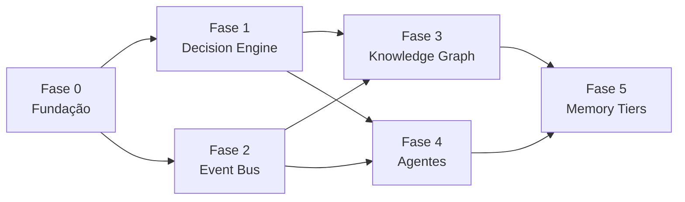

# 🗺️ Roadmap JARVIS OS — Realização do Decision OS

> [!jarvis] A tese deste documento
> O JARVIS não precisa de mais arquitetura — ela já existe em [[_Arquitetura JARVIS]] (4 camadas + Event Bus) e [[_Spec JARVIS]] (§8 prioridade = Decision Engine embrionária). O que falta é **realizar** o que está projetado: transformar contratos conceituais em sistemas rodando. Este roadmap sequencia essa realização.

> [!danger] O Gate único — vale pra TODA fase
> Nenhuma fase entra em produção se aumentar a carga cognitiva diária do operador. Cada entrega tem de passar em: **"o operador abre o Obsidian e vê menos, decide melhor."** Se uma fase expõe mais informação, mais listas ou mais complexidade na superfície, ela falhou — redesenha. Complexidade vai pra dentro; simplicidade fica na interface. (Princípio "Zero Anxiety" do directive = invariante, não meta.)

---

## 📍 Estado real hoje (paper vs. running)

| Componente (directive) | Projetado | Rodando | Lacuna |
|---|---|---|---|
| **Camada Memória** (Obsidian) | ✅ `_Spec` completo | ✅ vault vivo, plugins Dataview/Tasks instalados 29/06 | render confirmado; falta uso diário consolidado |
| **Decision Engine** | 🟡 §8 (score de prioridade) | 🟡 score ao vivo no Dashboard | falta o **log de decisões** (memória que aprende) |
| **Camada Operação** (n8n) | ✅ Event Bus conceitual | 🔴 trial expirado, 9 workflows parados | precisa migração self-host (kit pronto) |
| **Camada Cognição** (agentes) | ✅ Contrato de Autoridade | 🟡 Executive Assistant determinístico + Claude sob demanda | falta formalizar orquestração |
| **Knowledge Graph** | 🟡 `wiki/` + `dominio` + grafo nativo | 🟡 grafo nativo + MOCs por domínio | falta extração de entidades / dedup |
| **Memory System** (tiers) | 🟡 fluxo trilinear `raw→wiki→output` | 🟡 trilinear + git + 90 Arquivo | falta distinção formal dos 7 tiers |
| **Interface** (Dashboard/#daily) | ✅ Daily Brief canônico | 🟡 Dashboard decisão-first; #daily parcial | depende do n8n (Fase 2) |

**Leitura:** a fundação está forte. Os bloqueios reais são poucos e concretos — e todos cabem na Fase 0.

---

## 🧱 Fase 0 — Endurecimento da Fundação `[PRÉ-REQUISITO DE TUDO]`

> Não se constrói Decision OS sobre credencial vazada, entrega travada e consolidação pela metade.

| # | Item | Tipo | Dono |
|---|---|---|---|
| 0.1 | 🔴 **Rotacionar a chave YALT** (exposta, redigida no vault mas viva em `stash@{0}`); depois dropar a stash | Segurança | **Operador** (rotar no painel) + eu (dropar stash) |
| 0.2 | Mergear **PR #14** (pastas duplicadas + MOC JARVIS) | Git | Operador (clicar merge) |
| 0.3 | Resolver SSOT **`_master-index` vs `_master_index`** (decidir canônico, consolidar) | Canonicidade | Eu (proposta) → Operador (decisão) |
| 0.4 | Confirmar render dos 3 MOCs + Daily Brief com plugins novos | Validação | Eu |
| 0.5 | Linter pass no `_Spec` (limpar unicode invisível) | Higiene | Eu |

**Gate:** fundação segura, sem segredos vivos, sem PR pendente, SSOT único. **Done →** libera Fase 1.

---

## 🎯 Fase 1 — Decision Engine `[CORAÇÃO · maior alavancagem, menor complexidade]`

> O directive chama isto de "o coração do JARVIS". O sistema já prioriza (§8); falta ele **lembrar e aprender** das decisões.

**O que se constrói:**
- Novo `tipo: decisao` (entra no `_Spec §2` **antes** de propagar — regra do spec). Schema proposto:

  | prop | tipo | valores |
  |---|---|---|
  | `status` | text | `aberta` \| `decidida` \| `revisada` |
  | `contexto` | text | situação que forçou a decisão |
  | `alternativas` | list | opções consideradas |
  | `escolha` | text | o que foi decidido |
  | `confianca` | number | 0–100 no momento da decisão |
  | `resultado_esperado` | text | hipótese |
  | `resultado_real` | text | preenchido na revisão |
  | `licao` | text | o que se aprende (alimenta decisões futuras) |
  | `relacionado` | list | entidades/projetos/clientes ligados |

- Fluxo de captura leve (QuickAdd/template Templater) — registrar uma decisão em <30s.
- MOC `🧭 Decisões` (Dataview): abertas, aguardando revisão, padrões emergentes.
- Integração com o Dashboard: a seção **"Decisões aguardando aprovação"** do North Star passa a ter fonte real.

**Gate:** o Dashboard ganha 1 seção (decisões pendentes) e **esconde** todo o histórico de decisões atrás de Dataview colapsado. Carga cognitiva: neutra-a-menor. **Depende de:** Fase 0. **Done →** operador registra decisões e o sistema mostra padrões ("em negociações similares, X performou melhor").

---

## 🔌 Fase 2 — Event Bus real `[sistema nervoso liga]`

> Hoje o Event Bus é um **contrato de nomes** ([[_Arquitetura JARVIS]]), não um broker. Esta fase o torna real.

**O que se constrói:**
- Desbloquear n8n (migração self-host — kit já pronto em `70 Sistema/Automacao/n8n-selfhost/`).
- Webhook central (broker) consumindo o envelope canônico de evento já especificado.
- Religar os fluxos parados: Morning Brief delivery → `#daily`, sinais de CRM/prospecção.
- Eventos Obsidian→bus por mudança de propriedade (`ProjectBlocked`, `TaskCompleted`).

**Gate:** o contexto chega **empurrado** a um lugar só (`#daily`), espelhando o Dashboard — operador abre menos sistemas, não mais. **Depende de:** Fase 0 (segurança), independe da 1. **Done →** `#daily` vivo com Morning Brief + alertas Classe Crítica, nada mais.

---

## 🕸️ Fase 3 — Knowledge Graph ativo

> `wiki/` + `dominio` + grafo nativo já existem. Falta o grafo **se manter sozinho**.

**O que se constrói:**
- Extração de entidades das notas (clientes, projetos, conceitos, pessoas).
- Inferência de relações + sugestão de backlinks (eventos `NoteLinked`, `MemoryCreated`).
- Detecção e merge de conhecimento duplicado; preferência por notas atômicas.
- Cada objeto sabe: origem, relações, porquê, quando importa, dono, projetos dependentes.

**Gate:** o grafo trabalha em background; o operador **não vê** o processamento — só colhe notas melhor conectadas. Zero exposição de complexidade. **Depende de:** Fases 1–2 (eventos + decisões alimentam o grafo). **Done →** conhecimento compõe automaticamente.

---

## 🤖 Fase 4 — Camada de Agentes formalizada

> [[_Contrato de Autoridade dos Agentes]] já define quem age sobre cada evento. Falta orquestração rodando.

**O que se constrói:**
- Executive Assistant como **orquestrador** real (esvazia inbox, categoriza, gera Today/Next/Weekly) — nunca implementa, só delega.
- Especialistas por domínio (TOR/dev, BOBBY/growth, RESEARCH, HEALTH, FINANCE) consumindo eventos do bus.
- Método de entrega: **GSD Core** (spec-driven).
- **Ruflo permanece diferido** até `operational_agents >= 5` (limiar já documentado no Arsenal) — não integrar antes.

**Gate:** agentes colaboram sem conflito (autoridade clara por evento); operador vê só **decisões preparadas**, não o trabalho dos agentes. **Depende de:** Fase 2 (bus) + Fase 1 (decisões). **Done →** tarefas cognitivas repetitivas viram autônomas.

---

## 🧠 Fase 5 — Memory System multi-tier

> O fluxo trilinear já separa captura/conhecimento/saída. Esta fase formaliza os 7 tiers do directive sobre o que existe.

| Tier (directive) | Mapeamento no JARVIS |
|---|---|
| Raw Memory | `raw/inbox.md`, `raw/clips/` (imutável) |
| Working Memory | `10 Inbox/`, itens `#captura` |
| Long-term Memory | `wiki/knowledge/`, notas consolidadas |
| Semantic Memory | Knowledge Graph (Fase 3) |
| Decision Memory | `tipo: decisao` (Fase 1) |
| Procedural Memory | `tipo: sop`, `tipo: checklist` |
| Archived Memory | `90 Arquivo/` (`status: arquivado`) |

**O que se constrói:** regras de promoção/expiração entre tiers (working→long-term, stale→archived); nunca misturar tiers numa query. **Gate:** consolidação automática reduz o que o operador precisa revisar. **Depende de:** Fases 1–3. **Done →** a memória se cura sozinha.

---

## 🔒 Regras invariantes (todas as fases)

1. **Local-first** — tudo roda offline; cloud é opcional, nunca pré-requisito de funcionamento.
2. **Determinístico primeiro** — lógica de decisão é código auditável; LLM é camada, não fundação.
3. **Spec-first** — toda propriedade nova entra no `_Spec` antes de templates/queries.
4. **Aditivo** — fluxos novos não tocam produção; pastas **congeladas** (sem migração física sem dry-run aprovado).
5. **O Gate** — nenhuma fase que aumente carga cognitiva diária entra em produção.
6. **Reversível** — tudo em git, com tag de recuperação antes de mudança estrutural.

---

## 🧭 Dependências

> [!cyan] Próximo passo recomendado
> Iniciar a **Fase 0**. Itens 0.3/0.4/0.5 eu executo; 0.1 (rotacionar chave) e 0.2 (merge PR #14) são ações do operador. Só com a fundação fechada a Fase 1 (Decision Engine) começa.
