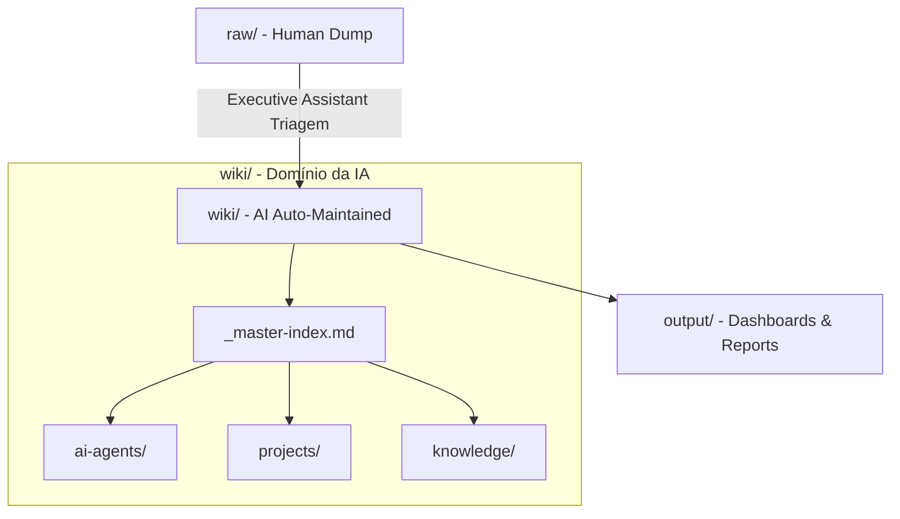

# ⚙️ _Spec JARVIS — Contrato do Sistema

> [!warning] Documento canônico
> Este arquivo é a **fonte da verdade** da arquitetura. Templates, Dashboard, MOCs e queries Dataview DEVEM seguir exatamente os nomes de propriedades, caminhos e convenções definidos aqui. Alterou aqui? Propague para os templates e queries.

## Princípio central

> **Propriedades (frontmatter) são a fonte da verdade para consultas. Pastas são apenas armazenamento.**

Toda query Dataview filtra por **propriedade** (`tipo`, `status`, `area`), nunca depende do caminho da pasta. Assim, uma nota pode ser movida de pasta (ou pelo Auto Note Mover) sem quebrar nenhum dashboard. Isso é o que mantém o sistema limpo após 10 anos.

---

## 1. Estrutura de pastas (fluxo + armazenamento)

### 1.1 Fluxo canônico `raw/` → `wiki/` → `output/`

A camada operacional do JARVIS é linear. Ela separa onde o humano despeja informação, onde a IA organiza, e onde o sistema entrega visão limpa.

```text
raw/                      → o Operador manda: dump universal, captura bruta
  inbox.md                → áudios transcritos, notas rápidas, capturas de voz
  clips/                  → artigos, PDFs e materiais brutos

wiki/                     → a IA organiza: domínio estruturado e auto-maintained
  _master-index.md        → índice soberano da memória operacional
  ai-agents/              → prompts, contratos e rotinas dos agentes
  areas/                  → contextos perenes
  projects/               → iniciativas ativas e dependências
  knowledge/              → conceitos e notas consolidadas

output/                   → o sistema entrega: compilação limpa e descartável
  daily_dashboard.md      → painel diário limpo
  query-results.md        → resultados automáticos de Dataview/Tasks
  slide-decks/            → relatórios e apresentações exportáveis
```



**Territórios de escrita:**
| Diretório | Dono | Regra |
|---|---|---|
| `raw/` | Operador | Humano cria/edita. IA lê, processa e remove itens já materializados em `wiki/`. |
| `wiki/` | IA | Escrita estruturada: índices, páginas, backlinks, rotinas e consolidação. |
| `output/` | Sistema | Sobrescrita de compilação: dashboards, relatórios e resultados gerados. |

> Estado de migração: esta camada foi adicionada sem mover a estrutura numerada existente. A migração física de notas só acontece por plano dry-run aprovado.

### 1.2 Estrutura numerada (armazenamento atual, escalável)

```
00 JARVIS/        → 🤖 JARVIS.md (dashboard), 📖 Guia do Sistema.md
10 Inbox/         → captura rápida, não classificada
20 Pessoal/
    Projetos/     → tipo: projeto, area: pessoal
    Diario/       → tipo: diario | semanal
    Objetivos/    → tipo: objetivo (nivel: objetivo | meta)
    Habitos/      → tipo: habito
    Estudos/      → tipo: estudo
    Ideias/       → tipo: ideia
30 Empresa/
    Projetos/     → tipo: projeto, area: empresa
    Reunioes/     → tipo: reuniao
    Documentacao/ → tipo: doc
40 CRM/
    Clientes/     → tipo: cliente
    Contatos/     → tipo: contato
50 Financeiro/
    Pessoal/      → tipo: lancamento, area: pessoal
    Empresa/      → tipo: lancamento, area: empresa
60 Conhecimento/
    Wiki/         → sub-sistema LLM-wiki (ver _Wiki — Como Manter)
    IA/Prompts/   → tipo: prompt
    Notas/        → tipo: nota
70 Sistema/
    Templates/    → templates Templater (não recebem tipo próprio de conteúdo)
    SOPs/         → tipo: sop
    Checklists/   → tipo: checklist
    Automacao/    → docs de automação
90 Arquivo/       → notas encerradas (status: arquivado)
```

`10 Inbox/` continua válido para a estrutura atual e compatibilidade de templates. Novos dumps universais entram preferencialmente em `raw/inbox.md`; notas estruturadas continuam obedecendo propriedades, templates e MOCs.

**Regra de nomeação de arquivos:**
- Notas-hub (MOC) e dashboards: prefixo emoji + nome — ex.: `🤖 JARVIS.md`, `🌱 Pessoal.md`.
- Projetos / clientes / docs: nome descritivo em Title Case — ex.: `Reformulação do Site.md`, `Acme Corp.md`.
- Reuniões: `YYYY-MM-DD Assunto.md` — ex.: `2026-06-27 Kickoff Acme.md`.
- Diário: `YYYY-MM-DD.md`. Semanal: `YYYY-[W]ww.md` — ex.: `2026-W26.md`.
- Lançamentos financeiros: `YYYY-MM-DD Descrição.md`.

---

## 2. Esquema de propriedades (CONTRATO — nomes exatos)

Toda nota de conteúdo carrega a **base comum** + as específicas do `tipo`.

**Base comum (todas as notas):**
| Propriedade | Tipo | Valores / formato |
|---|---|---|
| `tipo` | text | discriminador — ver tabela abaixo |
| `status` | text | depende do tipo |
| `area` | text | `pessoal` \| `empresa` (quando aplicável) |
| `criado` | date | `YYYY-MM-DD` |
| `atualizado` | date | `YYYY-MM-DD` |
| `tags` | list | temas transversais (ver taxonomia) |

**Valores de `tipo`:** `projeto`, `reuniao`, `cliente`, `contato`, `doc`, `objetivo`, `habito`, `estudo`, `ideia`, `sop`, `checklist`, `lancamento`, `prompt`, `nota`, `diario`, `semanal`, `sistema`.

### Propriedades por tipo

**projeto**
| prop | tipo | valores |
|---|---|---|
| `status` | text | `ideia` \| `ativo` \| `pausado` \| `concluido` \| `arquivado` |
| `area` | text | `pessoal` \| `empresa` |
| `prioridade` | text | `alta` \| `media` \| `baixa` |
| `inicio` | date | YYYY-MM-DD |
| `prazo` | date | YYYY-MM-DD |
| `progresso` | number | 0–100 |
| `cliente` | link | `[[Nome do Cliente]]` (opcional) |
| `objetivo` | link | `[[Objetivo]]` (opcional) |

**reuniao**
| prop | tipo | valores |
|---|---|---|
| `status` | text | `agendada` \| `realizada` \| `cancelada` |
| `data` | date | YYYY-MM-DD |
| `participantes` | list | links `[[Contato]]` |
| `projeto` | link | `[[Projeto]]` (opcional) |
| `cliente` | link | `[[Cliente]]` (opcional) |

**cliente**
| prop | tipo | valores |
|---|---|---|
| `status` | text | `lead` \| `ativo` \| `inativo` \| `perdido` |
| `empresa` | text | nome da empresa |
| `email` | text | |
| `telefone` | text | |
| `valor` | number | valor do negócio / MRR |
| `origem` | text | indicação \| inbound \| outbound \| evento |
| `responsavel` | text | |
| `proximo_contato` | date | YYYY-MM-DD |

**contato** — `status`: `ativo`\|`inativo`; `empresa` (link cliente), `email`, `telefone`, `cargo`.

**doc**
| prop | tipo | valores |
|---|---|---|
| `status` | text | `rascunho` \| `revisao` \| `publicado` |
| `categoria` | text | livre |
| `relacionado` | list | links |

**objetivo** (cobre Objetivos e Metas via `nivel`)
| prop | tipo | valores |
|---|---|---|
| `nivel` | text | `objetivo` (qualitativo) \| `meta` (mensurável) |
| `status` | text | `ativo` \| `concluido` \| `abandonado` |
| `horizonte` | text | `ano` \| `trimestre` \| `mes` \| `semana` |
| `prazo` | date | YYYY-MM-DD |
| `progresso` | number | 0–100 |
| `metrica` | text | indicador (p/ metas) |

**habito** — `status`: `ativo`\|`pausado`; `frequencia`: `diario`\|`semanal`; `meta_semanal` (number).

**estudo** — `status`: `backlog`\|`estudando`\|`concluido`; `disciplina` (text); `fonte` (text); `tipo_fonte`: `livro`\|`curso`\|`artigo`\|`video`\|`podcast`.

**ideia** — `status`: `nova`\|`desenvolvendo`\|`convertida`\|`descartada`; `area`.

**sop** — `status`: `rascunho`\|`ativo`\|`revisao`; `responsavel`; `versao` (number).

**checklist** — `status`: `ativo`\|`arquivado`; `contexto` (text).

**lancamento** (financeiro)
| prop | tipo | valores |
|---|---|---|
| `data` | date | YYYY-MM-DD |
| `valor` | number | sempre positivo |
| `mov` | text | `receita` \| `despesa` |
| `categoria` | text | livre |
| `conta` | text | livre |
| `area` | text | `pessoal` \| `empresa` |
| `status` | text | `pago` \| `pendente` |

**prompt** — `status`: `ativo`\|`rascunho`; `modelo` (text); `caso_uso` (text).

**diario** — `data` (date); `humor` (number 1–5); `energia` (number 1–5).
**semanal** — `semana` (text, ex. `2026-W26`).

---

## 3. Taxonomia de tags

Propriedades já capturam tipo/status/area. **Tags são só para TEMAS transversais** (não duplicar propriedades). Hierárquicas:

- Temas: `#tema/marketing`, `#tema/vendas`, `#tema/saude`, `#tema/financas`, `#tema/dev`, `#tema/ia`, `#tema/lideranca`
- Workflow: `#captura` (item no inbox a processar), `#revisar`, `#urgente`, `#aguardando`
- **Proibido:** criar tag que repita uma propriedade (ex.: `#projeto`, `#ativo`) — use a propriedade.

---

## 4. Convenção de Tarefas (plugin Tasks)

Formato emoji oficial do plugin. Tarefas podem viver em qualquer nota; o Dashboard as agrega.

```
- [ ] Descrição da tarefa 🔼 📅 2026-06-30
```
Emojis: `📅` vencimento (due), `⏳` agendada (scheduled), `🛫` início, `🔺`/`⏫`/`🔼`/`🔽` prioridade (mais alta→mais baixa), `🔁` recorrência, `✅` data de conclusão.

Buckets do Dashboard: **Hoje** (vence até hoje, não feita), **Esta semana**, **Próxima semana**, **Atrasadas** (vence antes de hoje), **Concluídas** (recentes).

---

## 5. Sintaxe — exemplos de referência

**Templater** (preferido sobre Templates core):
`<% tp.date.now("YYYY-MM-DD") %>` · `<% tp.file.title %>` · `<% tp.system.prompt("Pergunta") %>` · `<% tp.file.cursor() %>` · `<% tp.date.now("YYYY-MM-DD", 0, tp.file.title, "YYYY-MM-DD") %>`

**Dataview — sempre por propriedade:**
```dataview
TABLE status, prioridade, prazo, progresso
WHERE tipo = "projeto" AND status = "ativo"
SORT prioridade ASC, prazo ASC
```

**Tasks:**
```tasks
not done
due before tomorrow
sort by priority, due
hide task count
```

---

## 6. Plugins (consolidados)

Templater, Dataview, Tasks, QuickAdd, Calendar, Periodic Notes, Homepage, Style Settings, Iconize, Linter, Auto Note Mover, Buttons. Tema: **Minimal** (kepano) + Style Settings + snippet `jarvis.css`. Detalhes e config em `🔌 Plugins`.

---

## 7. Cores da marca JARVIS (para CSS)

- Fundo: `#0B0E14` (quase preto azulado) / superfícies `#11151F`
- Accent primário (ciano JARVIS): `#36C5F0` → `#22D3EE`
- Accent secundário (âmbar/alerta): `#F5A524`
- Sucesso `#22C55E` · Perigo `#EF4444` · Texto `#E6EDF3` · Texto suave `#8B98A9`

---

## 8. Sistema de Prioridade — "Filtro de Ruído"

Conceito de **Chefe de Gabinete**: o operador não vê o caos de 300 tarefas — vê **3 ações críticas hoje**. O backlog continua existindo, mas fica oculto até ser puxado. Isso reduz ansiedade e força foco.

**Propriedades opcionais de priorização** (aplicam a `projeto`, `objetivo` e `ideia`):
| prop | tipo | valores |
|---|---|---|
| `importancia` | number | `1` (baixa) · `2` (média) · `3` (alta) |
| `valor_estrategico` | number | `1` · `2` · `3` — peso do "porquê" (alinhamento à [[🪐 Constituição JARVIS]]) |
| `energia` | text | `alta` \| `media` \| `baixa` — energia/esforço exigido |
| `dependencia` | list | links do que bloqueia este item (opcional) |

**Fórmula de score** — o **contrato de prioridade** que TODOS os agentes usam (Executive Assistant, BOBBY, TOR…). Calculada ao vivo no Dataview, nunca armazenada:
```
score = importancia × 10        // 1–3
      + urgência(prazo)          // vencido/hoje = 12 · ≤3d = 8 · ≤7d = 5 · ≤30d = 2 · senão 0
      + valor_estrategico × 8    // 1–3 — o peso do "porquê", não só do "quando"
      + bônus_energia            // baixa = +2 (quick win) · média = +1 · alta = 0
```

**Dependências = porteiro, não fator.** Item com `dependencia` preenchida (ou `status: pausado`) está **bloqueado**: sai do ranking de ação e aparece em **⚠ Bloqueios** no Daily Brief. Não se prioriza o que não se pode executar — desbloqueia-se.

Expressão DQL reutilizável (pronta em [[📊 Biblioteca Dataview]] › Prioridade):
```
(default(importancia, 1) * 10
  + choice(!prazo, 0, choice(prazo <= date(today), 12, choice(prazo <= date(today) + dur(3 days), 8, choice(prazo <= date(today) + dur(7 days), 5, choice(prazo <= date(today) + dur(30 days), 2, 0)))))
  + default(valor_estrategico, 1) * 8
  + choice(energia = "baixa", 2, choice(energia = "media", 1, 0)))
```
Filtro de ação (exclui bloqueados): `WHERE status = "ativo" AND !dependencia`.

**Dois níveis:**
- **Tarefa (diário):** plugin Tasks mostra só as **3 críticas de hoje** (`limit 3`); o resto colapsa em "Depois disso".
- **Projeto/Objetivo (estratégico):** ranqueados pelo `score`. A prioridade emoji (`🔺/⏫/🔼/🔽`) rege as tarefas.

> Este score e o **Event Bus** ([[_Arquitetura JARVIS]]) são os dois contratos que unificam Obsidian + n8n + Slack + Claude Code.

---

## 9. Saúde & Treino — Tracking APEX / TALES OF TALLES

> [!warning] Extensão aditiva (revisar e aprovar)
> Seção adicionada para integrar o app de tracking **APEX / TALES OF TALLES · IDENTITY OS** ao vault, conforme a regra "adicione ao spec primeiro, depois propague aos templates/queries". É **aditiva** — não altera nenhuma seção existente. Operador: revise e mantenha ou ajuste; está versionada no git.

O app já estrutura a vida atlética em torno de **4 coaches**. Cada coach vira uma fonte de dados no vault, sem fundir o código do app (a integração é por **dados**, não por codebase — ver [[🔌 Ponte APEX ↔ JARVIS]]).

| Coach | Papel | Vira no vault | Tipo de nota |
|---|---|---|---|
| 🥊 ILIA TOPURIA | Striking / Boxe | Sessões de boxe + arsenal | `treino` (`modalidade: boxe`) |
| 🦾 CARIANI | Força & Condicionamento | Treinos de musculação + PRs | `treino` (`modalidade: musculacao`) |
| 🧑‍🍳 SANJI | Nutrição | Registro nutricional diário | `nutricao` |
| 🩺 MUZY | Ciência & Recuperação | Métricas corporais + readiness | `corporal` |

**Novos valores de `tipo`:** acrescentar `treino`, `nutricao`, `corporal` à lista da §2.
**Armazenamento (pasta-só):** `20 Pessoal/Saude/` com subpastas opcionais `Treinos/`, `Nutricao/`, `Corporal/`. Como sempre, **as queries filtram por `tipo`, nunca por pasta.**
**Campo comum de proveniência:** `fonte` (text) → `apex` (gravado pelo SYNC do app) | `manual` (criado no Obsidian). Permite distinguir o que veio do sync.

### `treino` (uma nota por sessão)
| prop | tipo | valores |
|---|---|---|
| `status` | text | `planejado` \| `feito` \| `falhou` |
| `data` | date | YYYY-MM-DD |
| `modalidade` | text | `musculacao` \| `boxe` \| `corrida` \| `mobilidade` \| `outro` |
| `coach` | text | `ilia` \| `cariani` (opcional; deriva da modalidade) |
| `duracao_min` | number | minutos |
| `volume_kg` | number | tonelagem total (carga×reps×séries) — musculação |
| `distancia_km` | number | corrida/bike (opcional) |
| `rpe` | number | esforço percebido 1–10 |
| `prs` | list | recordes batidos nesta sessão (texto livre) |
| `kcal_gasto` | number | estimativa (opcional) |
| `area` | text | sempre `pessoal` |
| `fonte` | text | `apex` \| `manual` |

Nome de arquivo: `YYYY-MM-DD Modalidade.md` — ex.: `2026-06-22 Musculacao Superior.md`.

### `nutricao` (uma nota por dia)
| prop | tipo | valores |
|---|---|---|
| `status` | text | `parcial` \| `fechado` (dia encerrado) |
| `data` | date | YYYY-MM-DD (única por dia) |
| `kcal` | number | calorias totais do dia |
| `proteina_g` | number | gramas |
| `carbo_g` | number | gramas |
| `gordura_g` | number | gramas |
| `agua_l` | number | litros |
| `refeicoes` | number | nº de refeições registradas |
| `aderencia` | number | 0–100 (% da meta diária) |
| `area` | text | sempre `pessoal` |
| `fonte` | text | `apex` \| `manual` |

Nome de arquivo: `YYYY-MM-DD Nutricao.md`.

### `corporal` (snapshot de métrica / body scan)
| prop | tipo | valores |
|---|---|---|
| `data` | date | YYYY-MM-DD |
| `peso_kg` | number | peso corporal |
| `gordura_pct` | number | % gordura (opcional) |
| `readiness` | number | 0–100 (prontidão do dia) |
| `sono_h` | number | horas de sono |
| `fadiga` | number | 1–5 (carga subjetiva) |
| `foto` | text | caminho/anexo da progress photo (opcional) |
| `area` | text | sempre `pessoal` |
| `fonte` | text | `apex` \| `manual` |

Nome de arquivo: `YYYY-MM-DD Corporal.md`.

### Metas diárias (referência do app, para % de adesão)
Perfil atual: **1,94 m · 77 kg → meta 84 kg** (welterweight). Metas-base (ajustáveis): `kcal ≥ 3000` · `proteina_g ≥ 165` · `agua_l ≥ 3` · `sono_h ≥ 7` · treino `meta_semanal 5` (ver hábito [[Exercicio]]).

> Hub da área: [[🩺 Saúde & Performance]] · Contrato de sincronização: [[🔌 Ponte APEX ↔ JARVIS]] · Coaches são personas de dados, não novos agentes do [[_Contrato de Autoridade dos Agentes]].
