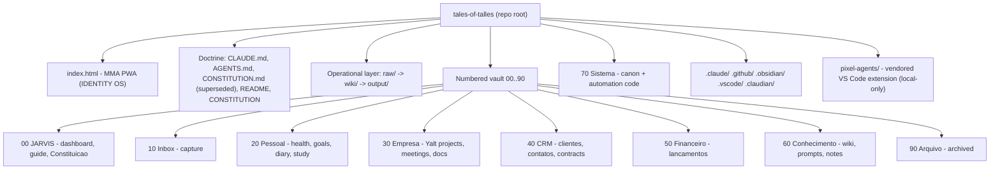
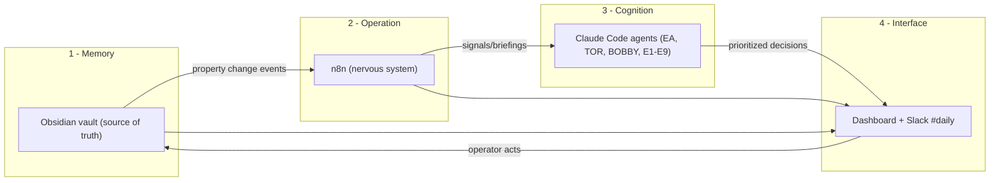
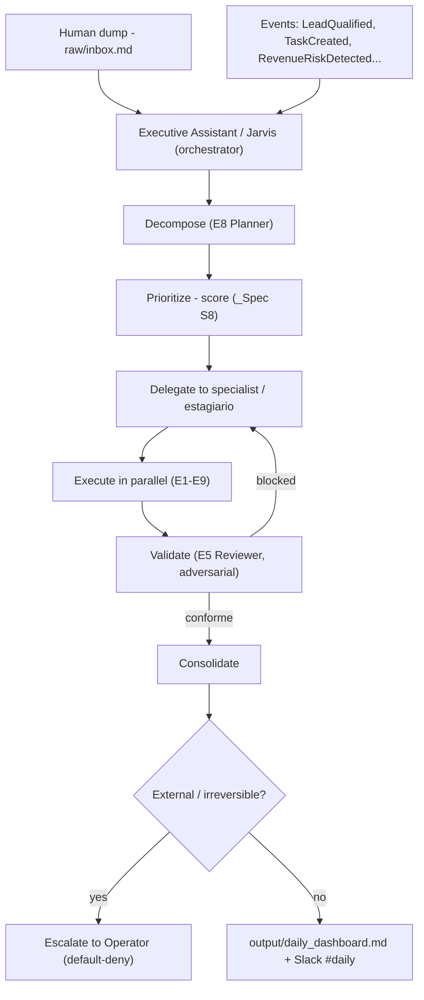
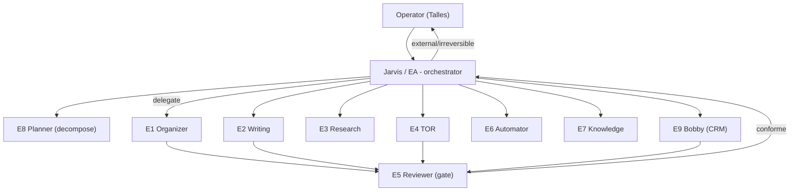
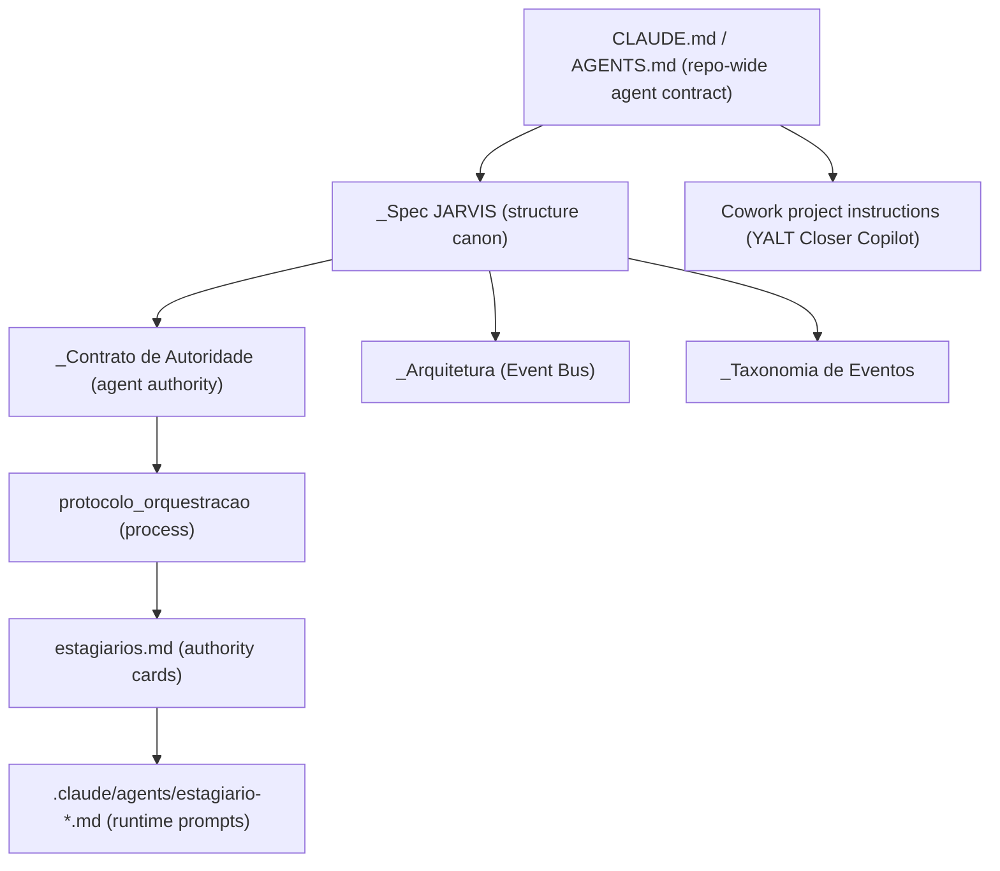
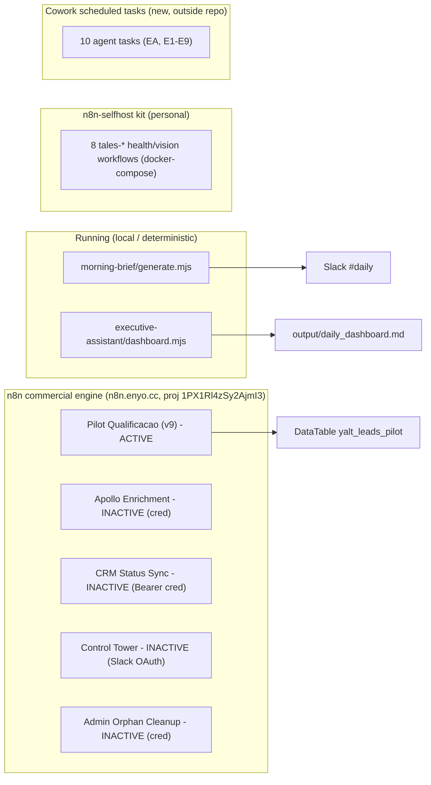
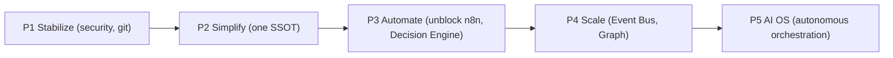

# ARCHITECTURE_ANALYSIS.md — `tales-of-talles`

> **Audit type:** Read-only architectural audit (no project files modified).
> **Auditor role:** Lead Architect, first read.
> **Repository:** `github.com/talesoftalles1-dev/tales-of-talles`
> **Branch audited:** `reconcile/vault-merge-20260628` (commit `2c8d668`) — the live working branch, richer than default `main`. Local-only additions (`pixel-agents/`, `.cursor/`) inspected from the working copy.
> **Date:** 2026-07-09
> **Language note:** Written in English to match the audit brief; the vault's canon is PT-BR by mandate (`_Spec JARVIS §Idioma`). A PT-BR port can be produced on request.
> **Convention marker:** Every claim is tagged **[O]** (observation, evidence-backed), **[I]** (inference), or **[R]** (recommendation). Where something could not be verified it is stated as **[UNVERIFIED]**, never guessed.

---

## Coverage & Method

Fully read: `README.md`, `CLAUDE.md`, `AGENTS.md`, `CONSTITUTION.md`, `70 Sistema/_Spec JARVIS.md`, `_Arquitetura JARVIS.md`, `_Contrato de Autoridade dos Agentes.md`, `_Roadmap JARVIS OS.md`, `wiki/ai_agents/*` (roster, estagiarios, protocolo, executive_assistant, index), `.claude/agents/estagiario-9-comercial.md`, `70 Sistema/Automacao/catalogo_automacoes.md`, `CRM MCP — Contract & Scaffold.md`, `CRM Unification — Plan.md`, `adr_ruflo_vs_subagentes_nativos.md`, `morning-brief/generate.mjs` + `lib/slack.mjs`, `executive-assistant/dashboard.mjs`, `.github/workflows/deploy-pages.yml`, `.claude/proven-config.json`, `.obsidian/community-plugins.json`, `.gitignore`, `30 Empresa/Chapter 14`, `00 JARVIS/🤖 JARVIS.md`, `output/TALES OF TALLES OS — Master Evolution Report.md`, `60 Conhecimento/Wiki/log.md`, `pixel-agents/package.json` + tree.

Sampled (git-tree + headers, not line-by-line): the "Chapter 07–31" book, `70 Sistema/Templates/*` (18), `n8n-selfhost/workflows/*` (8 JSON), per-area `_Index.md`/MOC files, health logs.

Not opened in full **[UNVERIFIED]**: `_Taxonomia de Eventos.md`, `🪐 Constituição JARVIS.md`, `_Stack de Ferramentas (Arsenal).md`, `index.html` internals (479 KB PWA), `pixel-agents/` source beyond manifest, individual Chapter bodies, n8n workflow JSON internals.

---

## 1. Executive Summary

**[O]** `tales-of-talles` is not one project — it is **two fused deliverables plus a vendored tool in a single git repository**:

1. **TALES OF TALLES · IDENTITY OS** — a single-file offline-first HTML PWA (`index.html`, ~479 KB) for MMA/athlete performance tracking, with four AI "coaches" (Sanji, Ilia, Cariani, Muzy). This is what `README.md` describes and what the GitHub Pages CI deploys.
2. **JARVIS OS** — a personal + business "cognitive operating system" implemented as an **Obsidian vault** (folders `00 JARVIS/` … `90 Arquivo/`, plus a `raw/ → wiki/ → output/` operational layer). This is the substance of the repository (~191 markdown files of doctrine, agents, automation, CRM, knowledge).
3. **`pixel-agents/`** — a **third-party VS Code extension** (`pablodelucca.pixel-agents`, MIT) vendored into the vault (including `node_modules/`), used to visualize Claude Code agents as animated characters. Local-only; not on `main`.

**Why it exists.** **[O]** The stated mission is an "AI Operating System" for commercial ops, CRM, prospecting, enrichment, outreach, follow-up, data organization, knowledge management, executive assistance, automation, agent orchestration, and a personal "Second Brain." The vault's own governance frames it as an **anti-anxiety "Decision OS"**: hide the backlog, surface only the 3 actions that matter today (`_Spec §8`, `_Arquitetura`, `🤖 JARVIS.md`).

**Problem solved.** **[O]** Fragmentation of a founder-operator's life/business across many tools. The design unifies memory (Obsidian), operation (n8n), cognition (Claude Code agents), and interface (Dashboard + Slack `#daily`) under two shared contracts: a **priority score** (`_Spec §8`) and an **Event Bus vocabulary** (`_Arquitetura`).

**Who understands it after this section.** A reader now knows: it is a doctrine-rich Obsidian-centric AI-OS for one operator (Talles/Yalt), architecturally mature but only partially running, bundled in the same repo as an unrelated MMA PWA and a vendored agent-visualizer.

**One-line verdict.** **[I]** The *architecture and doctrine* are near-complete and unusually disciplined; the *running system* is early. The binding constraint is **realization and consolidation**, not design — a conclusion the repo's own `output/TALES OF TALLES OS — Master Evolution Report.md` already reached ("consolidação > expansão"). This audit corroborates and quantifies it.

---

## 2. Repository Overview

### 2.1 Top-level hierarchy

### 2.2 Folder purpose & relationships

| Folder | Purpose (evidence) | Real fill level |
|---|---|---|
| `raw/` | Human dump zone; `inbox.md` + `clips/` (`_Spec §1.1`, Authority Contract "territórios") | Low — `inbox.md` seeded, `clips/` empty (`.gitkeep`) **[O]** |
| `wiki/` | AI-maintained domain: `_master_index.md`, `ai_agents/`, `areas/`, `projects/`, `knowledge/` | **Scaffold** — `areas/`, `projects/`, `knowledge/` = 2 files each (`.gitkeep` + `index.md`). Only `ai_agents/` is populated **[O]** |
| `output/` | Regenerable deliveries: `daily_dashboard.md`, reports, slide decks | Active — dashboard + morning-brief + reports present **[O]** |
| `00 JARVIS/` | Dashboard (`🤖 JARVIS.md`), system guide, `🪐 Constituição JARVIS.md` | Populated **[O]** |
| `20 Pessoal/` | Health/goals/diary/study; strongest sample content (training, nutrition, body logs dated 06-20…06-27) | Medium — real-looking health logs **[O]** |
| `30 Empresa/` | Yalt: `Chapter 13–16`, projects (`Automacao Comercial Yalt`), meetings (`Kickoff Acme`) | Medium, sample-heavy (Acme placeholder) **[O]** |
| `40 CRM/` | `Chapter 17–19` (data model, sync contracts, ESP), 1 client note | Thin in-vault by design — real leads live in external Yalt CRM **[O]** |
| `50 Financeiro/` | `Chapter 20–22`, 2 sample lançamentos | Thin/sample **[O]** |
| `60 Conhecimento/` | `Chapter 23–26`, `IA/Prompts/`, LLM-wiki sub-system | LLM-wiki **unused** — `Wiki/log.md`: "No sources ingested yet" **[O]** |
| `70 Sistema/` | The canon: `_Spec`, `_Arquitetura`, `_Contrato`, `_Roadmap`, Chapters 27–31, CRM plans, **real automation code** (`morning-brief/`, `executive-assistant/`, `n8n-selfhost/`) | Dense, high-quality **[O]** |
| `90 Arquivo/` | Archived notes (`status: arquivado`) | Used (migration archives) **[O]** |

**[O] Structural duality.** Two parallel structures coexist: the **numbered folders** (`00…90`, the real content, storage-oriented) and the **trilinear** `raw/wiki/output` (the aspirational AI-domain, largely empty). `_Spec §1` acknowledges this: "esta camada foi adicionada sem mover a estrutura numerada… migração física só por plano dry-run aprovado." This is deliberate but is a live source of confusion (which structure is authoritative for a given note type?).

### 2.3 Important root files

| File | Role |
|---|---|
| `CLAUDE.md` / `AGENTS.md` | Agent operating contract (mirror pair; `AGENTS.md` header says it is generated from `CLAUDE.md`). **[O]** |
| `CONSTITUTION.md` | **Superseded** governance (English), explicitly archived in favour of the PT-BR canon set (`_Spec` §10–13). Still at root as history. **[O]** |
| `README.md` | Describes the MMA PWA; contains a **duplicated/garbled title line** (`# tales-of-talles# 🥊 TALES OF TALLES…`). **[O]** |
| `index.html` | The PWA app (canonical artifact "C1" per canonicity banners). **[O]** |
| `install.cmd`, `sw.js`, `2026-07-06.md`, `Sem título*.canvas/.base` | Installer, PWA service worker, stray empty daily note and empty Obsidian canvases (noise). **[O]** |

---

## 3. System Architecture

### 3.1 The 4-layer model (as designed)

**[O]** `_Arquitetura JARVIS.md` defines four layers bound by an Event Bus:

### 3.2 Data / execution / decision flow

**[O] Information flow ("consciousness"):** `CRM → n8n → BOBBY`, `Calendar → n8n → EA`, `Projects → TOR` all converge on `Slack #daily`, mirroring the Dashboard — one surface, not five.

**[O] The two unifying contracts** (explicitly): (1) the **priority score** (`_Spec §8`), a deterministic DQL formula used by every agent; (2) the **Event Bus envelope + vocabulary** (`_Arquitetura`). Critically, `_Arquitetura` states the bus is currently **"um contrato de nomes, não um broker rodando"** — a naming convention, not a running message broker. **[O]**

### 3.3 AI workflow (orchestration)

**[O]** `protocolo_orquestracao_jarvis.md` formalizes a canonical loop: `RECEBER → DECOMPOR → PRIORIZAR → DELEGAR → EXECUTAR (parallel) → CONSOLIDAR → VALIDAR → ENTREGAR/ESCALAR`. "Jarvis" = the Executive Assistant elevated to orchestrator; it decides priority and delegates but never executes domain actions. Parallelism rules require independence, one-writer-per-artifact, and central consolidation (no auto-merge).

### 3.4 Architectural inconsistencies (surfaced here, detailed in §11)

- **[O]** Two agent taxonomies: the **domain agents** of the Authority Contract (EA, TOR, BOBBY, RESEARCH, WRITING, FINANCE, CALENDAR, KNOWLEDGE, HEALTH) vs the **Estagiários E1–E9**. They are reconciled on paper (`estagiarios.md` maps each to a Contract line; E9=BOBBY 1:1) but the mapping is non-obvious and asymmetric (FINANCE/CALENDAR/HEALTH have no estagiário; E5/E6/E8 introduced "new authority").
- **[O]** Two structures (numbered vs trilinear); the older English `CONSTITUTION.md` used a `contexto` property that was **never adopted** (the vault uses `area` + `dominio`).
- **[O]** Two/three n8n instances referenced (`n8n.enyo.cc` project `1PX1Rl4zSy2AjmI3`; the MCP-connected instance; the self-host kit) — see §7.

---

## 4. Agent Ecosystem

### 4.1 Inventory

**[O]** There are **three distinct agent populations** in this repo:

**A. JARVIS domain agents** — authority defined in `_Contrato de Autoridade dos Agentes.md`:

| Agent | Purpose | Create | Edit | Prioritize | Execute | Archive |
|---|---|:--:|:--:|:--:|:--:|:--:|
| Executive Assistant (Jarvis) | Orchestrate priority/attention | ✅¹ | ✅ | ✅ | ❌ | ⚠️ |
| TOR (dev) | Software execution | ✅ | ✅ | ❌ | ⚠️ | ✅ |
| BOBBY (commercial) | CRM/leads/growth | ✅ | ✅ | ✅⁶ | ⚠️⁷ | ✅ |
| RESEARCH | Verified multi-source research | ✅ | ✅ | ❌ | ✅ | ⚠️ |
| WRITING | Draft docs/proposals | ✅ | ✅ | ❌ | ⚠️ | ❌ |
| FINANCE | Record/read finances | ✅ | ✅ | ❌ | ❌¹¹ | ⚠️ |
| CALENDAR | Agenda | ⚠️ | ⚠️ | ❌ | ⚠️ | ✅ |
| KNOWLEDGE | Long-term wiki memory | ✅ | ✅ | ❌ | ✅ | ⚠️ |
| HEALTH | Habits/training/energy | ✅ | ✅ | ❌ | ❌ | ⚠️ |

Legend: ✅ autonomous · ⚠️ human approval · ❌ forbidden. Principles: separation of powers, **default-deny**, irreversible/external → human, strategy is human, auditable.

**B. Estagiários E1–E9** — execution substrate, native Claude Code subagents (`.claude/agents/estagiario-*.md`), each with `name/description/tools/model` frontmatter (verified in `estagiario-9-comercial.md`: `tools: Read, Grep, Glob, Bash, WebFetch`, `model: sonnet`):

| # | Codename | Domain | Authority status |
|---|---|---|---|
| E1 | ORGANIZER | raw→wiki triage | derives from EA |
| E2 | WRITING | drafts | bound to WRITING |
| E3 | RESEARCH | research | bound to RESEARCH |
| E4 | TOR | code | bound to TOR |
| E5 | REVIEWER | adversarial QA | new, ratified PR #20 |
| E6 | AUTOMATOR | n8n/scripts | new, ratified PR #20 |
| E7 | KNOWLEDGE | wiki upkeep | bound to KNOWLEDGE |
| E8 | PLANNER | decomposition | new, ratified PR #20 |
| E9 | BOBBY | commercial/CRM | bound to BOBBY (1:1) |

**C. IDENTITY OS coaches** (inside `index.html`, separate product): Sanji (nutrition), Ilia (striking), Cariani (S&C), Muzy (recovery) — "Coach Protocol v2": one lead coach, ≤140 chars, action-oriented, silent when no intervention needed.

### 4.2 Per-agent detail (JARVIS execution layer — from `estagiarios.md` + agent files)

Each estagiário file binds six fields (Propósito · Pode · Não pode · Inputs · Outputs · Escalonamento) + Tools + Local memory (`wiki/ai_agents/memoria/`) + DoD. Example — **E9 BOBBY** `[O]`:
- **Inputs:** Yalt CRM (skill `yalt-crm`), pipeline, events `LeadCreated/LeadQualified/RevenueRiskDetected`.
- **Outputs:** commercial briefings, updated CRM, prioritized follow-ups, draft outreach.
- **Strength:** explicit data caveats (`status:null`→"new"; `locationsCount` unreliable; never fabricate numbers) and a **network preflight** (`GET /v1/health`; on `403 blocked-by-allowlist`, stop — sandbox allowlist, not a credential error).
- **Weakness/dependency:** live CRM calls depend on the sandbox allowlisting `portal.sales-crm.yalt.co`, which by its own note is **currently blocked** → BOBBY can only run against live CRM via local Claude Code CLI or the n8n bridge. **[O]**

### 4.3 Collaboration model

**[O] Strengths:** clean separation of powers; least-privilege via per-agent `tools`; adversarial review gate (E5); documented conflict resolution (`Especialista → EA → Operador`); immutability clause (only the Operator edits the canon).
**[I] Weaknesses:** the roster is **documented far ahead of use** ("ainda em rodagem inicial"); orchestration is manual (main-loop Jarvis), not a running scheduler; the domain-vs-estagiário duality risks drift; no telemetry proves agents actually run (the roster file even pledges "honestidade: só estado real").

---

## 5. Prompt Architecture

**[O] Hierarchy (inheritance by wikilink, not literal include):**

| Aspect | Finding |
|---|---|
| Shared context | **[O]** Strong: everything roots in `_Spec §8` (priority) + `_Arquitetura` (events). Agent files repeatedly cite the same canon by wikilink. |
| Inheritance | **[O]** `estagiario-*.md` are declared "projeção mecânica" of `estagiarios.md`, which is a projection of `_Contrato`. Clear chain, with an explicit tie-break ("se divergirem, o Contrato vence"). |
| Duplication | **[O]** Deliberate mirroring: `CLAUDE.md`↔`AGENTS.md` (mirror pair, drift-checked by `vault-lint`); `estagiarios.md`↔`.claude/agents/*` (canon vs runtime). Managed, but real duplication surface. |
| Quality | **[O]** High: explicit Pode/Não-pode, DoD, escalation, data caveats, network preflight. Among the best-specified agent prompts I have reviewed. |
| Missing prompts | **[I]** No prompt file yet for FINANCE, CALENDAR, HEALTH as *executable* agents (they exist only as Authority Contract rows). The IDENTITY OS coaches live only inside `index.html`. |
| Simplification opp. | **[R]** The domain-agent table and the estagiário table encode the same authority twice in different shapes; a single generated matrix would cut drift risk. |

**[O]** A recent operational addition (outside the repo, in Cowork's `…/outputs/Scheduled/`) now instantiates the roster as **10 scheduled tasks** (one per agent) with a generator skill at `70 Sistema/Automacao/agentes-programados/SKILL.md`. This is the first time the prompt architecture is bound to a running cadence rather than on-demand invocation. **[I]** It is a partial realization of Roadmap Phases 2/4 without n8n.

---

## 6. Knowledge Management

| Dimension | Finding | Evidence |
|---|---|---|
| Obsidian setup | 16 community plugins installed: dataview, tasks, templater, obsidian-git, excalidraw, calendar, style-settings, tag-wrangler, **realclaudian / claude-sidebar / copilot / mcp-tools-istefox / vault-as-mcp** (AI + MCP exposure of the vault). **[O]** | `.obsidian/community-plugins.json` |
| **Spec drift** | `_Spec §6` lists a *different* plugin set (QuickAdd, Periodic Notes, Homepage, Iconize, Linter, Auto Note Mover, Buttons) — several are **not installed**, and several installed ones are **not in the spec**. **[O]** | `_Spec §6` vs `community-plugins.json` |
| Vault structure | Property-first: "propriedades são a fonte da verdade; pastas são só armazenamento." Every Dataview filters by `tipo/status/area`, never by path. Excellent for longevity. **[O]** | `_Spec §Princípio`, `🤖 JARVIS.md` queries |
| Taxonomy | Rigorous frontmatter contract per `tipo` (projeto, reuniao, cliente, lancamento, objetivo…); `dominio` ∈ {jarvis, yalt, talles} drives MOCs and graph colors; tags reserved for *themes only* (forbidden to duplicate a property). **[O]** | `_Spec §2–3` |
| Memory system | Trilinear `raw→wiki→output` + `90 Arquivo` + git history. Roadmap maps a 7-tier model (Raw/Working/Long-term/Semantic/Decision/Procedural/Archived) onto existing folders. **[O]** | `_Spec §1`, `_Roadmap Fase 5` |
| **Knowledge retrieval** | Native graph + MOCs + Dataview. The dedicated **LLM-wiki** sub-system (`60 Conhecimento/Wiki/`) is **scaffolded but empty** — `log.md`: "No sources ingested yet — domain not yet chosen." `wiki/knowledge/` = index only. **[O]** | `Wiki/log.md`, `wiki/` tree |
| Naming | MOCs use emoji prefixes; meetings `YYYY-MM-DD Assunto`; diary `YYYY-MM-DD`. Consistent — but conflicts with `CONSTITUTION.md §XIII` (snake_case dirs), which was superseded. **[O]** | `_Spec §1.2` |
| Linking | Heavy, disciplined wikilinking + `relacionado:` frontmatter; anti-orphan intent (E7 KNOWLEDGE). **[O]** | agent files, most notes |

**[I] Net:** the *knowledge framework* is excellent; the *knowledge base* is thin and partly duplicated (the English "Chapters 07–31" book runs parallel to the PT-BR `70 Sistema` canon and to per-area content). Retrieval today = human browsing MOCs + Dataview; automated entity extraction / dedup (Roadmap Phase 3) is not built.

---

## 7. Automation Analysis

### 7.1 Inventory & state

| Automation | Trigger | Input | Output | Failure point |
|---|---|---|---|---|
| `morning-brief` (`.mjs`) | Local schedule (Windows) | vault notes + `raw/inbox.md` | Slack `#daily` brief + `output/…-morning-brief.txt` | Delivery cfg (n8n webhook / Slack token) in gitignored `config.json`; no delivery cfg → throws **[O]** |
| `executive-assistant/dashboard.mjs` | Windows task ~07:00 | vault properties + inbox | `output/daily_dashboard.md` | Deterministic; exit 1 if vault unreadable. **Does not** do LLM triage (needs interactive EA) **[O]** |
| n8n "Pilot Qualificação" | n8n trigger | `yalt_leads_pilot` | AI-qualified leads + draft email | Active (v9) **[O]** |
| n8n Apollo Enrichment | chained | qualified leads | enriched email/company | **INACTIVE** — missing `Header Auth` (Apollo) cred **[O]** |
| n8n CRM Status Sync | schedule | leads | Yalt CRM status | **INACTIVE** — CRM Bearer cred "ainda não existe nenhuma" **[O]** |
| n8n Control Tower | schedule 08:30/16:30 | DataTable | Slack `#sdr` report | **INACTIVE** — Slack OAuth reconnection **[O]** |
| n8n-selfhost (8 `tales-*`) | docker-compose | health/vision/Notion | personal automations | Kit present; activation state **[UNVERIFIED]** |
| Cowork scheduled tasks (new) | cron/manual | vault + Yalt CRM | `output/` + Slack | Depends on CRM key (`.secrets/`) + sandbox allowlist for live CRM **[I]** |

### 7.2 Reading

**[O]** The **deterministic local automations are genuinely good engineering**: zero-dependency Node ESM, shared `lib/` (no scoring duplication between morning-brief and the EA dashboard), dry-run/force/no-slack flags, idempotency (`alreadyPostedToday`), structured debug logs. This is the most "running" part of the OS.
**[O]** The **n8n commercial engine is built but ~80% blocked** by missing credentials and OAuth (Apollo, CRM Bearer, Slack), consistent with the memory that the n8n Cloud trial expired and the roster's "BOBBY degraded." The catalog (`catalogo_automacoes.md`) even flags redundancy: "Briefing Diário SDR (legado) duplica o Orquestrador."
**[R] Automation opportunities:** (a) unblock credentials via the self-host kit (Roadmap Phase 2); (b) collapse the duplicate SDR/Control-Tower workflows; (c) the new Cowork scheduled tasks can bridge the gap *now* for delivery-to-vault, but cannot reach the live CRM until `portal.sales-crm.yalt.co` is allowlisted or run locally.

---

## 8. Commercial Workflow (scored 0–10)

Scope: how the *repository* currently supports each area. Score reflects **built × running**.

| Area | Score | Rationale (evidence) |
|---|:--:|---|
| CRM management | 5 | Full `yalt-crm` skill (leads/logs/stats/email/routes) + data-model chapters (17–18). But sandbox allowlist blocks live calls; `CRM Status Sync` inactive; in-vault CRM area is 1 note. **[O]** |
| Prospecting | 5 | n8n Prospector + Google-Maps Prospector + Apollo MCP available; `sales:prospect` skill. Several prospecting flows inactive. **[O]** |
| Lead enrichment | 4 | Apollo Enrichment workflow **built but inactive** (missing cred); Kaspr/Lusha endpoints in skill. Designed, not running. **[O]** |
| Research / company intel | 5 | RESEARCH agent + WebSearch + new weekly research scheduled task; no running pipeline, sample-only output. **[I]** |
| Sales pipeline | 6 | `DataTable yalt_leads_pilot` + `pipeline_state` model + stage-updater + Dashboard Funil; Pilot active. Control Tower inactive. **[O]** |
| Follow-up | 6 | Follow-up Sequence + Lembretes workflows + new daily BOBBY task; delivery blocked (Slack OAuth / n8n). **[O]** |
| Outreach | 5 | Outreach Writer (gpt-5.2) produces copy-ready HTML; **sending gated by design** (human approval) and blocked (Gmail incompat). **[O]** |
| Email writing | 6 | Outreach Writer + Pilot drafts + `emails/*` skill endpoints + email test plan doc. Drafts yes, send gated. **[O]** |
| Client management | 4 | Real clients live in external CRM; in-vault `40 CRM` is chapters + 1 sample. Thin. **[O]** |

**Commercial composite ≈ 5.1 / 10.** **[I]** A **well-architected commercial engine whose execution is credential/OAuth/allowlist-blocked.** Design maturity ~8; running maturity ~3.

---

## 9. Personal Assistant Workflow (scored 0–10)

| Area | Score | Rationale |
|---|:--:|---|
| Task management | 7 | Tasks plugin + `_Spec §8` priority + Dashboard "Top 3" (`limit 3`). Strong, real queries. **[O]** |
| Personal notes | 6 | Numbered folders + 18 templates; scaffolded with samples. **[O]** |
| Memory | 5 | Trilinear + `90 Arquivo` + git; but `wiki/` empty, LLM-wiki unused, 7-tier not formalized. **[O]** |
| Planning | 6 | E8 Planner + Roadmap + objetivos; new weekly planner task. Embryonic. **[I]** |
| Daily workflow | 7 | `dashboard.mjs` runs ~07:00 → `daily_dashboard.md`; morning-brief → `#daily`. Genuinely working locally. **[O]** |
| Knowledge capture | 5 | `raw/inbox.md` + capture chapters; but materialization raw→wiki is manual and wiki is empty. **[O]** |
| Decision support | 4 | Priority score is live, but the **Decision Engine** (`tipo: decisao` + decision log) — the roadmap's "coração" — is **not built** (Phase 1 pending). **[O]** |
| Executive assistant | 7 | Deterministic EA dashboard + orchestration protocol + EA scheduled task. Strongest area. **[O]** |

**Personal composite ≈ 5.9 / 10.** **[I]** The daily cockpit works; the "learning" parts (decisions, semantic memory) are designed but unbuilt.

---

## 10. Repository Quality (scored 0–10)

| Dimension | Score | Rationale |
|---|:--:|---|
| Organization | 7 | Clear numbered structure + canon hierarchy; **−** numbered/trilinear duality and Chapters-vs-`70 Sistema` overlap. **[O]** |
| Maintainability | 5 | Excellent docs, but **26 remote branches** (incl. both `main` and `master`, and typo-dupes `vault-vivo-limco`/`limpo`, `pendencias`/`pendencias-clean`), **~10 orphaned `.claude/worktrees/`**, work "materialized by direct file copy" from unmerged worktrees, **committed logs** (72 `.log`, `.claude-flow/logs`). **[O]** |
| Scalability | 6 | Property-driven Dataview scales well; **−** single mixed repo (app + vault + vendored extension incl. `node_modules`), 51 MB. **[O]** |
| Readability | 8 | Outstanding PT-BR prose, callouts, tables, diagrams. **[O]** |
| Consistency | 5 | Spec drift (plugins), lingering superseded docs, dual roster models, `main`+`master`, README garbled title. **[O]** |
| Reusability | 6 | Templates + shared `lib/` + the new generator skill; much bespoke. **[O]** |
| Documentation | 9 | Exceptional — arguably **over-documented** relative to running code. **[O]** |
| Modularity | 6 | Layered concept + modular `.mjs`; **−** app/vault/tool fused in one repo. **[O]** |

**Quality composite ≈ 6.5 / 10.** **[I]** Documentation and design quality are elite; operational hygiene (git topology, secrets, dead weight) drags it down.

---

## 11. Technical Debt

| Item | Type | Evidence | Impact |
|---|---|---|---|
| **Leaked CRM key** in git history (`stash@{0}`), rotation pending | 🔴 Security | `_Roadmap Fase 0.1`, `Runbooks/Rotate_CRM_Key.md`, CRM Unification Sprint A | **High** — live secret |
| `mcp-tools-istefox` plugin `data.json` token incident | 🔴 Security | `.gitignore` note "Incidente 2026-06-30" | High (mitigated by ignore) |
| **26 branches, `main` + `master`, typo-duplicate branches** | 🟠 Git hygiene | `git ls-remote` | High — no single trunk; confusion |
| **~10 orphaned worktrees** in `.claude/worktrees/`, content ported by file-copy not merge | 🟠 Process | provenance notes in `protocolo`, `adr_ruflo`; `find` of worktrees | High — parallel realities, lost history |
| Committed logs (72 `.log`, `.claude-flow/logs/*`) | 🟡 Bloat | git tree | Medium — churn, noise, 51 MB |
| **Vendored `pixel-agents/` incl. `node_modules`, dist, test artifacts** | 🟡 Bloat/coupling | `pixel-agents/package.json` (3rd-party MIT ext) | Medium — third-party repo inside personal vault |
| Superseded docs kept in place | 🟡 Doc debt | `CONSTITUTION.md`, `CRM MCP — Contract & Scaffold.md` (both marked superseded) | Medium — parallel-source risk (self-mitigated by banners) |
| **Structural duality** numbered vs `wiki/` (empty) | 🟡 Arch | `_Spec §1`, empty `wiki/areas|projects|knowledge` | Medium — "which is canonical?" |
| **Dual roster** (domain agents vs E1–E9) | 🟡 Arch | `_Contrato` vs `estagiarios.md` | Medium — drift, double-maintenance |
| English "Chapters 07–31" parallel to PT-BR canon | 🟡 Doc dup | `10..90` chapters vs `70 Sistema` | Medium — overlap (Ch.29↔`_Contrato`, Ch.14↔`catalogo`) |
| README garbled/duplicated title; stray `Sem título*.canvas`, empty `2026-07-06.md` | 🟢 Cosmetic | root tree | Low |
| Spec §6 plugin list ≠ installed plugins | 🟢 Drift | `_Spec §6` vs `community-plugins.json` | Low |
| No `package.json`/lockfile for `.mjs` tools | 🟢 Minor | tree | Low (zero-dep by design) |

**[R]** The three **High** items (secret rotation, branch/worktree consolidation, git bloat) are the real "stabilize" backlog — and they match the repo's own `_Roadmap Fase 0`.

---

## 12. Gaps Against the Vision

| Vision (stated goal) | Current State | Gap | Priority | Recommendation |
|---|---|---|:--:|---|
| Commercial operations | n8n Pilot active; rest credential-blocked | Execution blocked | **P0** | Self-host n8n + create Apollo/CRM/Slack creds (Phase 2) |
| CRM supervision | Full skill + contracts; live calls sandbox-blocked | Connectivity | **P0** | Allowlist `portal.sales-crm.yalt.co` or run BOBBY via local CLI |
| Lead enrichment | Apollo workflow inactive | Credential | **P1** | Add `Header Auth`; smoke-test 10 leads |
| Prospecting | Prospector flows partial | Activation | **P1** | Consolidate + schedule |
| Email generation | Outreach Writer produces drafts | Sending path | **P1** | Decide AgentMail vs Gmail; keep human-approve |
| Customer follow-up | Workflows + new daily task | Delivery (Slack OAuth) | **P1** | Reconnect Slack; dedupe SDR/Control-Tower |
| Data organization | Trilinear designed; `wiki/` empty | Materialization | **P1** | Run E1 Organizer on real captures |
| Personal "Second Brain" | Framework rich; base thin; LLM-wiki unused | Content + ingestion | **P2** | Ingest real sources; activate Phase 3 graph |
| Executive assistance | Deterministic dashboard runs | LLM triage manual | **P2** | Formalize EA triage cadence |
| Automation | Local `.mjs` solid; n8n blocked | Ops | **P0/P1** | Phase 0 + Phase 2 |
| AI agent orchestration | Contracts + E1–E9 + 10 scheduled tasks | Running use/telemetry | **P2** | Prove weeks of real use before Ruflo |
| Decision support | Priority score only | **Decision Engine unbuilt** | **P1** | Build `tipo: decisao` + log (Phase 1) |

---

## 13. Improvement Opportunities

**Quick Wins** (low effort, high/again-immediate impact)

| # | Improvement | Effort | Impact |
|---|---|:--:|:--:|
| Q1 | Rotate leaked CRM key + drop stash | S | 🔴 High |
| Q2 | Delete/merge orphan worktrees; pick one trunk (`main`), delete `master` + typo-dupes | S–M | High |
| Q3 | `git rm --cached` the committed logs; add to `.gitignore` | S | Med |
| Q4 | Fix README (single title) | XS | Low-Med |
| Q5 | Reconcile `_Spec §6` plugin list with reality | XS | Low |
| Q6 | Move superseded docs to `90 Arquivo/` | S | Med |

**Medium-term**

| # | Improvement | Effort | Impact |
|---|---|:--:|:--:|
| M1 | Self-host n8n; create Apollo/CRM/Slack credentials; unblock the engine | M | 🔴 High |
| M2 | Collapse duplicate SDR/Control-Tower workflows | S | Med |
| M3 | Generate the agent authority matrix from ONE source (kill dual-roster drift) | M | Med |
| M4 | Decide numbered-vs-`wiki/` and either populate `wiki/` or retire it | M | High |
| M5 | Build the Decision Engine (`tipo: decisao` + `🧭 Decisões` MOC) | M | High |

**Long-term**

| # | Improvement | Effort | Impact |
|---|---|:--:|:--:|
| L1 | Real Event Bus broker (webhook) consuming the canonical envelope | L | High |
| L2 | Active Knowledge Graph (entity extraction, dedup, backlink inference) | L | High |
| L3 | Formalize 7-tier memory with promotion/expiry rules | L | Med |

**Nice-to-have**

| # | Improvement | Effort | Impact |
|---|---|:--:|:--:|
| N1 | Split repo: app (`index.html`) vs JARVIS vault vs remove vendored `pixel-agents` (use as installed extension) | M | Med |
| N2 | CI vault-lint (canon drift, broken wikilinks) — `hermes/ci-vault-lint-phase1b` branch suggests this is started | M | Med |
| N3 | Reconsider Ruflo only after the 3-part re-eval gate (ADR) | L | Low |

---

## 14. Risks (ranked by severity)

| # | Risk | Category | Severity | Note |
|---|---|---|:--:|---|
| R1 | Live CRM key exposed in git history (`stash@{0}`) | Security | 🔴 Critical | Rotate first; anything else waits. `_Roadmap 0.1` |
| R2 | Secrets via Obsidian MCP plugins (`mcp-tools-istefox` incident; `vault-as-mcp` exposes the vault as an MCP server) | Security | 🔴 High | Token leak already recorded; audit MCP surface |
| R3 | Single-operator bus factor; deep tribal knowledge in one person's head | Operational | 🟠 High | Docs mitigate, but no second maintainer |
| R4 | Git topology chaos (26 branches, `main`+`master`, unmerged worktrees ported by copy) | Maintenance | 🟠 High | History divergence; risk of losing/overwriting work |
| R5 | Commercial engine depends on external credentials/OAuth not under version control | Operational | 🟠 Med-High | One expired trial froze the pipeline |
| R6 | Sandbox allowlist blocks `portal.sales-crm.yalt.co` → agents can't reach live CRM in-session | Scalability | 🟠 Med | Must run locally or bridge via n8n |
| R7 | Documentation outruns implementation → "paper OS" perception; canon can rot vs reality | Maintenance | 🟡 Med | Spec drift already visible (plugins) |
| R8 | Vendored third-party `pixel-agents` (with `node_modules`) inside the vault | Security/Bloat | 🟡 Med | Supply-chain + size; prefer installed extension |
| R9 | Two n8n instances + self-host kit → config sprawl | Scalability | 🟡 Med | Pick one canonical instance |
| R10 | Dual roster / dual structure → agent or query targets the wrong model | Architecture | 🟡 Low-Med | Generate from one source |

---

## 15. Roadmap (phased)

This aligns with — and re-sequences — the repo's own `_Roadmap JARVIS OS.md`, adding operational-hygiene items this audit surfaced. Invariant gate (from the repo, kept): *no phase ships if it increases the operator's daily cognitive load.*

### Phase 1 — Stabilize
- **Objectives:** remove security exposure; establish one trunk; stop the bleed.
- **Deliverables:** rotate CRM key + drop stash (R1); audit MCP token surface (R2); pick `main` as trunk, delete `master` + typo-dupe branches, merge-or-delete worktrees (R4); `git rm --cached` logs; fix README.
- **Dependencies:** Operator (rotate keys, click merges).
- **Expected impact:** safe, coherent base. Unblocks everything.

### Phase 2 — Simplify / Consolidate
- **Objectives:** one source of truth per concept; shed dead weight.
- **Deliverables:** archive superseded docs; decide numbered-vs-`wiki/` (populate or retire); generate a single agent-authority matrix; collapse duplicate SDR/Control-Tower workflows; extract or remove vendored `pixel-agents`; reconcile spec §6 with installed plugins.
- **Dependencies:** Phase 1.
- **Expected impact:** lower maintenance surface; canon matches reality.

### Phase 3 — Automate / Unblock
- **Objectives:** turn the built-but-blocked engine on.
- **Deliverables:** self-host n8n (kit exists); create Apollo/CRM-Bearer/Slack credentials; allowlist or locally-run CRM access; reconnect Slack `#daily`/`#sdr`; wire the new Cowork scheduled tasks as the interim cadence; build the **Decision Engine** (`tipo: decisao` + `🧭 Decisões`).
- **Dependencies:** Phases 1–2.
- **Expected impact:** commercial follow-up + daily brief run unattended; decisions become data.

### Phase 4 — Scale
- **Objectives:** the nervous system and memory become self-sustaining.
- **Deliverables:** real Event Bus broker (canonical envelope); active Knowledge Graph (entity extraction, dedup, backlink inference); 7-tier memory with promotion/expiry; CI vault-lint gate.
- **Dependencies:** Phase 3.
- **Expected impact:** knowledge and events compose automatically; drift is caught by CI.

### Phase 5 — AI Operating System
- **Objectives:** orchestration runs itself; the operator sees only prepared decisions.
- **Deliverables:** EA as always-on orchestrator over the bus; specialists consuming events autonomously within the Authority Contract; GSD-Core delivery method; re-evaluate Ruflo only against its documented 3-part gate.
- **Dependencies:** Phases 1–4 + proven weeks of real agent use.
- **Expected impact:** repetitive cognitive tasks become autonomous under human-approved guardrails — the stated end state.

---

## 16. Final Assessment

**How close is this repository to becoming an AI Operating System?**

### Overall score: **58 / 100**

| Axis | Weight | Score | Weighted |
|---|:--:|:--:|:--:|
| Architecture & doctrine | 25% | 90 | 22.5 |
| Knowledge framework | 15% | 70 | 10.5 |
| Running automation (local) | 15% | 65 | 9.75 |
| Commercial engine (running) | 20% | 35 | 7.0 |
| Agent orchestration (running) | 15% | 40 | 6.0 |
| Operational hygiene (security/git) | 10% | 25 | 2.5 |
| **Total** | 100% | | **≈ 58** |

**Interpretation.** **[I]** This is a **design-complete, execution-early** system. As a *blueprint* for an AI OS it is ~90/100 — genuinely excellent: layered architecture, an event vocabulary, a default-deny authority matrix, a deterministic priority engine, and disciplined anti-bifurcation governance, all internally consistent and self-auditing. As a *running* AI OS it is ~40/100: a deterministic Morning Brief and daily dashboard actually run locally, but the commercial engine is credential-blocked, the Event Bus is a naming convention (no broker), the Decision Engine and Knowledge Graph are unbuilt, the `wiki/` is empty, and the agent fleet is documented far ahead of proven use.

**What is preventing 100%** (in priority order):

1. **Operational hygiene (−, security & git).** A live secret in history and a chaotic branch/worktree topology mean the foundation isn't trustworthy yet. *Cheapest, highest-leverage fix.*
2. **Blocked execution.** The commercial value (enrichment, CRM sync, outreach delivery, Slack briefings) is built but off — waiting on credentials, OAuth, self-host, and a sandbox allowlist. Nothing here is a design problem; it's activation.
3. **Missing cognitive core.** The "heart" the repo names for itself — the **Decision Engine** (learn from decisions) and the **active Knowledge Graph** — is not implemented.
4. **Event Bus is conceptual.** No broker means the four layers don't actually talk at runtime; integration is manual.
5. **Content & usage gap.** Frameworks are rich but the base is seed/sample data; `wiki/` is empty; agents lack telemetry proving weeks of real use.
6. **Consolidation debt.** Dual roster, dual structure, superseded docs, and a parallel English "Chapters" book create drift risk and dilute the single-source-of-truth ideal the system otherwise enforces well.

**Bottom line.** **[I]** The gap to an AI OS is **not architectural** — it is **stabilization, activation, and consolidation**. Execute Phases 1–3 and this crosses ~75–80/100 with no new design. The repository's own Master Evolution Report said it first: *consolidação > expansão.* This audit's only amendment is to put **security + git hygiene ahead of everything**, because an OS cannot be trusted on an untrusted foundation.

---

### Appendix — Audit integrity notes
- **[O]** = observed with cited evidence · **[I]** = reasoned inference · **[R]** = recommendation · **[UNVERIFIED]** = not confirmed in this pass.
- Branch audited: `reconcile/vault-merge-20260628` (`2c8d668`), the live working branch; `pixel-agents/` and `.cursor/` inspected from the local working copy (not on `main`).
- Not fully read (declared, not guessed): `_Taxonomia de Eventos`, `🪐 Constituição JARVIS`, `_Stack de Ferramentas (Arsenal)`, `index.html` internals, `pixel-agents/` source, individual Chapter bodies, n8n workflow JSON internals, `70 Sistema/Templates/*` bodies.
- No existing project files were modified. Only this file (`ARCHITECTURE_ANALYSIS.md`) was created.

