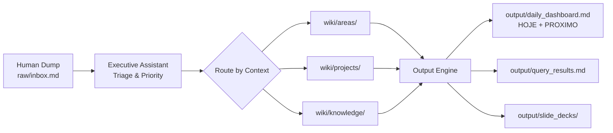

# CONSTITUTION.md — JARVIS OS Governance ⛔ SUPERSEDED

> [!danger] Documento superseded (2026-06-30)
> Este documento **não é mais canônico**. O canon estrutural do JARVIS é o [[_Spec JARVIS]] (PT-BR), complementado por [[_Contrato de Autoridade dos Agentes]], [[🪐 Constituição JARVIS]], [[_Arquitetura JARVIS]] e [[_Taxonomia de Eventos]]. Navegação: [[_master_index]].
>
> **Motivo:** este arquivo (inglês) duplicava a governança que o conjunto PT-BR já define, e seu modelo de dados (`contexto`) nunca foi adotado — o vault usa `area` + `dominio` (~137 notas). As 4 partes de valor único (nomenclatura, governança de migração, regras anti-bifurcação, tabela de canonicidade) foram **absorvidas** em [[_Spec JARVIS]] §10–§13.
>
> O conteúdo abaixo é mantido como **referência histórica** (regra de migração: não deletar).

---

## Conteúdo histórico (não-canônico)

## Article I — Purpose

JARVIS OS is a unified, anti-anxiety Personal & Business Cognitive Operating
System. It eliminates informational noise by hiding chaos and filtering reality.
The operator never sees a wall of 150+ tasks. The system surfaces only what
matters right now.

## Article II — Life Unification Principle

There is no physical separation between Work, Life, Studies, and Finance.
Everything coexists within the same vault, separated strictly by **Context**
(frontmatter property `contexto`), never by directory boundary.

## Article III — Trilinear Architecture

The vault is divided into three isolated data-flow zones. Mixing human inputs
with AI-generated data is strictly forbidden.

```
vault/
├── raw/           # HUMAN DOMAIN — input/dump only
├── wiki/          # AI DOMAIN — auto-maintained knowledge & core
└── output/        # DELIVERY DOMAIN — system-compiled state
```

### Zone 1: `raw/` — Human Domain

- **Purpose:** Universal ingestion point for all raw inputs.
- **Contents:** Voice transcriptions, quick ideas, links, web clippings, raw
  PDFs, chaotic captures.
- **Rule:** Nothing in `raw/` is organized. It is a dump zone. The Executive
  Assistant processes it daily.
- **Key files:** `raw/inbox.md` (primary capture), `raw/clips/` (external media).

### Zone 2: `wiki/` — AI Domain

- **Purpose:** Auto-maintained knowledge base, agent configurations, projects,
  areas, and permanent notes.
- **Contents:** Agent state manifests, area MOCs, project trackers, atomic
  knowledge notes, the master index.
- **Rule:** Content here is structured, tagged, and maintained by agents. Human
  edits are welcome but agents enforce consistency.
- **Key files:** `wiki/_master_index.md` (central registry),
  `wiki/ai_agents/` (agent contracts).

### Zone 3: `output/` — Delivery Domain

- **Purpose:** System-compiled state for human consumption.
- **Contents:** Daily dashboard, query results, briefing summaries, slide decks.
- **Rule:** Files here are **regenerable**. They can be deleted and rebuilt from
  `wiki/` and `raw/` data at any time. Never edit `output/` files directly —
  change the source and regenerate.
- **Key files:** `output/daily_dashboard.md` (the clean cockpit),
  `output/query_results.md` (Dataview compilations).

## Article IV — Canonicity (inherits from AGENTS.md)

| Artefact | Source of Truth | Where to Edit |
|---|---|---|
| App (`index.html`) | this repo | via PR |
| Morning Brief / JARVIS specs | Vault/Obsidian | in the Vault |
| System architecture docs | this repo (reference) | via PR |
| Agent contracts (`wiki/ai_agents/`) | this repo | via PR |
| Secrets / credentials | secret manager | **never** in repo |

## Article V — The Executive Assistant

The Executive Assistant (EA) is the central orchestrating agent. Its sole
mission is to process `raw/inbox.md` daily, map items to their contexts, and
calculate absolute priority. The EA does not write code or perform research — it
triages, prioritizes, and routes.

See: `wiki/ai_agents/executive_assistant.md` for the full contract.

## Article VI — Adaptive Display

The system hides the entire backlog. The dashboard exposes only:

- **HOJE** — maximum 3 critical actions for today.
- **PROXIMO** — secondary items shown only if energy/time allows.

The operator never sees the full task list unless explicitly requesting it.

## Article VII — Agent Roster

| Agent | Domain | Authority |
|---|---|---|
| **Executive Assistant** | Triage, priority, daily agenda | Reads `raw/`, writes `output/` |
| **TOR** | Software execution, code tasks | Reads `wiki/projects/`, executes |
| **BOBBY** | Commercial ops, CRM, lead sync | Reads `wiki/areas/empresa/`, writes CRM |
| **RESEARCH** | Knowledge synthesis, learning | Reads `wiki/knowledge/`, writes insights |
| **FINANCE** | Revenue, billing, budgets | Reads `wiki/areas/financeiro/` |
| **HEALTH** | Training, nutrition, recovery | Reads `wiki/areas/pessoal/` |

## Article VIII — Priority Formula

```
Priority = w_deadline * (1 / days_until_due)
         + w_importance * importance_score
         + w_time * (available_time / estimated_effort)
         + w_energy * energy_level
         + w_deps * (1 - dependency_ratio)
```

All weights default to 1. The operator can adjust via a settings note.

## Article IX — Data Flow



## Article X — Frontmatter Contract

Every note in `wiki/` must have:

```yaml
---
tipo: <area | project | task | note | agent | index>
status: <backlog | active | done | archived | canonico>
titulo: <human-readable title>
criado: <ISO 8601>
atualizado: <ISO 8601>
tags: [...]
---
```

Notes in `raw/` have no required frontmatter — they are chaotic by design.

## Article XI — Migration Governance

Existing files in the numbered directories (`00 Sistema/`, `10 Inbox/`, etc.)
are migrated to the trilinear structure via a controlled process:

1. **No deletion** — files are moved, never deleted.
2. **Redirect stubs** — a stub note remains at the old location with a
   `[[new location]]` link.
3. **Batch migration** — migrations happen in PRs, never ad-hoc.
4. **Verification** — after migration, all backlinks are verified.

## Article XII — Rules for Agents

1. Do not create variant files (`_2.html`, `_FINAL.html`, `_backup.md`).
2. Do not bifurcate specs. One source of truth per concept.
3. No secrets in the repo.
4. Changes to this Constitution require Operator approval via PR.
5. Do not fabricate work on files that do not exist (AGENTS.md Rule 5).

## Article XIII — Naming Conventions

- **Directories:** `snake_case`, lowercase. Example: `ai_agents/`, `slide_decks/`.
- **Files:** `snake_case` for new system files. Legacy chapter files retain their
  names until migrated.
- **Properties:** `snake_case` in frontmatter keys.
- **Tags:** lowercase, hyphen-separated. Example: `#sistema`, `#crm-sync`.

---

**Effective date:** 2026-06-27
**Version:** 1.0
