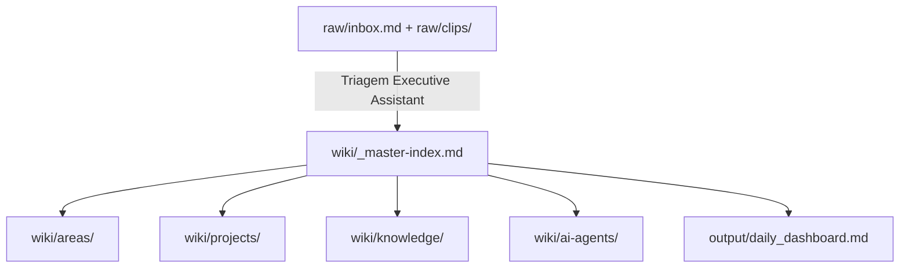

# 🧭 Master Index — JARVIS Wiki

Este é o índice soberano da camada `wiki/`: o domínio onde a IA organiza, liga e mantém a memória operacional do JARVIS.

## Regra de ouro

`raw/` é entrada humana. `wiki/` é memória estruturada. `output/` é entrega gerada. Nenhuma decisão canônica nasce em `output/`.

## Fluxo

## Índices principais

| Área | Função | Entrada |
|---|---|---|
| [[ai-agents/index|ai-agents]] | Rotinas, contratos e prompts de agentes | Executive Assistant, TOR, BOBBY, KNOWLEDGE |
| [[areas/index|areas]] | Contextos perenes por área de vida/empresa | saúde, finanças, trabalho, pessoal |
| [[projects/index|projects]] | Iniciativas ativas e dependências | projetos com ação ou decisão pendente |
| [[knowledge/index|knowledge]] | Conceitos consolidados e notas de referência | aprendizados, padrões, fontes processadas |

## Ponte com a estrutura atual

A estrutura numerada (`00 JARVIS/` a `90 Arquivo/`) continua ativa. Este índice não move arquivos por conta própria; ele governa o fluxo novo e aponta para notas existentes quando elas ainda vivem na estrutura numerada.

## Integração de Saúde (APEX / CAMP 2026)

O app **APEX / TALES OF TALLES** entra no JARVIS como **dados**, não como código (anti-fusão de codebase). Os 4 coaches viram tipos de nota:

| Coach | Tipo | Hub |
|---|---|---|
| 🥊 Ilia (boxe) · 🦾 Cariani (força) | `treino` | [[🩺 Saúde & Performance]] |
| 🧑‍🍳 Sanji (nutrição) | `nutricao` | idem |
| 🩺 Muzy (corpo/readiness) | `corporal` | idem |

Contrato de dados em [[_Spec JARVIS]] §9 · sincronização app→vault em [[🔌 Ponte APEX ↔ JARVIS]]. Armazenamento: `20 Pessoal/Saude/` (queries filtram por `tipo`).

## Rotina do Executive Assistant

1. Varrer `raw/inbox.md`, `raw/clips/` e `10 Inbox/`.
2. Classificar cada item: tarefa, projeto, área, conhecimento, comercial, financeiro ou descarte.
3. Materializar conteúdo estruturado em `wiki/` ou nas notas existentes do vault.
4. Atualizar este índice quando surgirem novas áreas, projetos, agentes ou conceitos.
5. Regenerar `output/daily_dashboard.md` sem expor o rastro técnico.

## Pendências de migração

- [ ] Gerar mapa dry-run: nota atual → destino sugerido no fluxo `raw/wiki/output`.
- [ ] Validar links, aliases e queries antes de qualquer movimentação física.
- [ ] Decidir se `60 Conhecimento/Wiki/` será mantido como sub-sistema especializado ou absorvido por `wiki/knowledge/`.
