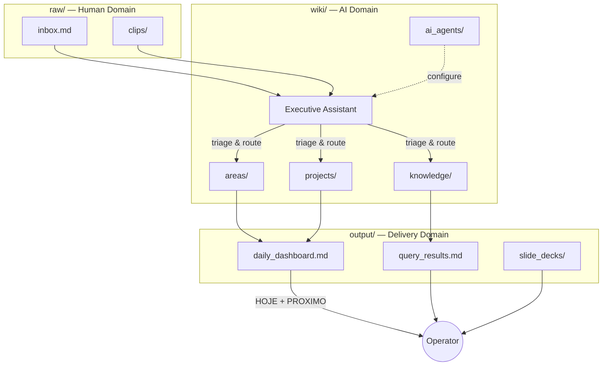

# Master Index — JARVIS OS

> Central registry and navigation map for the entire JARVIS OS vault. This is
> the single source of truth for finding anything in the system.

---

## Governance

- [[CONSTITUTION]] — trilinear architecture, rules, naming conventions
- [[AGENTS]] — canonicity rules (C1 app, C2 Morning Brief)

## Agent Contracts

- [[wiki/ai_agents/executive_assistant|Executive Assistant]] — triage, priority, daily agenda orchestrator

## Areas (Continuous Domains)

| Area | Context | Legacy Location |
|---|---|---|
| Pessoal (Health, Training, Goals) | `pessoal` | `20 Pessoal/` |
| Empresa (Projects, Commercial, Legal) | `empresa` | `30 Empresa/` |
| CRM (Data Model, Sync, Outreach) | `crm` | `40 CRM/` |
| Financeiro (Revenue, Billing, Budgets) | `financeiro` | `50 Financeiro/` |
| Conhecimento (Vault Structure, Templates) | `conhecimento` | `60 Conhecimento/` |

> Areas will be populated in `wiki/areas/` as content is migrated from legacy
> numbered directories. Each area gets a `_index.md` MOC file.

## Projects (Finite Initiatives)

> Active projects will be tracked in `wiki/projects/`. Each project gets its own
> directory with a `_index.md` manifest.

## Knowledge (Permanent Atomic Notes)

> Compiled insights, atomic notes, and permanent reference material live in
> `wiki/knowledge/`.

## System Foundation (Legacy Reference)

These chapters define the JARVIS OS architecture. They currently live in the
legacy `00 Sistema/` and `70 Sistema/` directories and will be migrated into
`wiki/` as part of the trilinear transition.

### Foundation Chapters (00 Sistema)

- [[Chapter 01 — Executive Assistant]] — EA role and architecture
- [[Chapter 02 — Prioritization Formula]] — quantitative priority math
- [[Chapter 03 — Adaptive Agenda]] — TODAY/NEXT display strategy
- [[Chapter 04 — Agent Orchestration]] — inter-agent coordination
- [[Chapter 05 — Decision Surface & Dashboard]] — dashboard design
- [[Chapter 06 — Contracts & Taxonomy]] — data contracts

### Operational Chapters (70 Sistema)

- [[Chapter 27 — Automations & n8n Bridge]]
- [[Chapter 28 — Security & Secrets Runbook]]
- [[Chapter 29 — Agent Roster & Authority]]
- [[Chapter 30 — Monitoring & Alerts]]
- [[Chapter 31 — Bootstrap & Maintenance]]

### CRM Integration

- [[CRM Unification — Plan]]
- [[CRM — Mapeamento de Entidades]]
- [[CRM MCP — Contract & Scaffold]]
- [[CRM n8n Workflows — README]]

## Output (Delivery Domain)

- [[output/daily_dashboard|Daily Dashboard]] — the clean cockpit (HOJE + PROXIMO)
- [[output/query_results|Query Results]] — auto-generated Dataview compilations
- `output/slide_decks/` — exportable briefing summaries

## Data Flow

