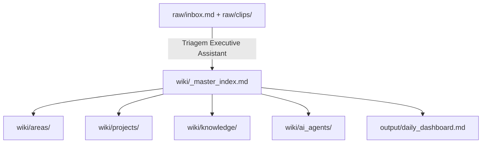

# 🧭 Master Index — JARVIS OS

> Registro central e mapa de navegação da camada `wiki/`: o domínio onde a IA organiza, liga e mantém a memória operacional do JARVIS. É a fonte única para encontrar qualquer coisa no sistema.

## Regra de ouro

`raw/` é entrada humana. `wiki/` é memória estruturada. `output/` é entrega gerada. **Nenhuma decisão canônica nasce em `output/`.**

## Hierarquia do canon

O canon do JARVIS é um conjunto de documentos **PT-BR**. Toda dúvida estrutural resolve por aqui:

| Documento | Responsabilidade |
|---|---|
| [[_Spec JARVIS]] | **Canon estrutural** — pastas, propriedades, prioridade, nomenclatura, governança |
| [[_Contrato de Autoridade dos Agentes]] | Quem (qual agente) pode Criar / Editar / Priorizar / Executar / Arquivar |
| [[🪐 Constituição JARVIS]] | Valores pessoais do Operador — filtro de decisão acima dos objetivos |
| [[_Arquitetura JARVIS]] | Event Bus e integração Obsidian + n8n + Slack + Claude Code |
| [[_Taxonomia de Eventos]] | Vocabulário de eventos do sistema |

> A antiga `CONSTITUTION.md` (inglês) foi **superseded** por este conjunto em 2026-06-30 — ver [[_Spec JARVIS]] §13.

## Arquitetura multiagente (Jarvis orquestrador + Estagiários)

Camada de cognição do JARVIS ([[_Arquitetura JARVIS]] Camada 3), materializada em 2026-07-03:

| Documento | Responsabilidade |
|---|---|
| [[protocolo_orquestracao_jarvis]] | Como o **Jarvis** decompõe → prioriza → delega → paraleliza → consolida → valida (FASE 1 + 3) |
| [[estagiarios]] | Cartas de autoridade dos 8 **Estagiários** (camada de execução, FASE 2) |
| [[adr_ruflo_vs_subagentes_nativos]] | Decisão: subagentes nativos do Claude Code; Ruflo diferido |
| [[🔁 Automacoes]] §10 | Automações orquestradas por agentes (FASE 4) |

> Governança: E5 (Revisão), E6 (Automações) e E8 (Planejamento) introduzem linhas novas na matriz de autoridade — **pendentes de ratificação do Operador** (merge do PR = aprovação, [[_Contrato de Autoridade dos Agentes]] cláusula de imutabilidade).

## Índices principais (`wiki/`)

| Área | Função | Entrada |
|---|---|---|
| [[wiki/ai_agents/index\|ai_agents]] | Rotinas, contratos e prompts de agentes | Jarvis (orquestrador), Estagiários E1–E8, TOR, BOBBY, KNOWLEDGE |
| [[wiki/areas/index\|areas]] | Contextos perenes por área de vida/empresa | saúde, finanças, trabalho, pessoal |
| [[wiki/projects/index\|projects]] | Iniciativas ativas e dependências | projetos com ação ou decisão pendente |
| [[wiki/knowledge/index\|knowledge]] | Conceitos consolidados e notas de referência | aprendizados, padrões, fontes processadas |

## Fluxo

## Ponte com a estrutura numerada

A estrutura numerada (`00 JARVIS/` a `90 Arquivo/`) continua ativa como **armazenamento**. Este índice não move arquivos por conta própria; ele governa o fluxo e aponta para notas existentes. Lembre: **queries filtram por propriedade (`tipo` / `status` / `area` / `dominio`), nunca por caminho de pasta** ([[_Spec JARVIS]] §1).

## Integração de Saúde (APEX / TALES OF TALLES)

O app **APEX** entra no JARVIS como **dados**, não como código (anti-fusão de codebase). Os 4 coaches viram tipos de nota:

| Coach | Tipo | Hub |
|---|---|---|
| 🥊 Ilia (boxe) · 🦾 Cariani (força) | `treino` | [[🩺 Saúde & Performance]] |
| 🧑‍🍳 Sanji (nutrição) | `nutricao` | idem |
| 🩺 Muzy (corpo / readiness) | `corporal` | idem |

Contrato de dados em [[_Spec JARVIS]] §9 · sincronização app→vault em [[🔌 Ponte APEX ↔ JARVIS]]. Armazenamento: `20 Pessoal/Saude/`.

## Rotina do Executive Assistant

1. Varrer `raw/inbox.md`, `raw/clips/` e `10 Inbox/`.
2. Classificar cada item: tarefa, projeto, área, conhecimento, comercial, financeiro ou descarte.
3. Materializar conteúdo estruturado em `wiki/` ou nas notas existentes do vault.
4. Atualizar este índice quando surgirem novas áreas, projetos, agentes ou conceitos.
5. Regenerar `output/daily_dashboard.md` sem expor o rastro técnico.

Autoridade e limites do EA: [[_Contrato de Autoridade dos Agentes]].

## Pendências de migração

- [ ] Gerar mapa dry-run: nota atual → destino sugerido no fluxo `raw/wiki/output`.
- [ ] Validar links, aliases e queries antes de qualquer movimentação física.
- [ ] Decidir se `60 Conhecimento/Wiki/` será mantido como sub-sistema especializado ou absorvido por `wiki/knowledge/`.
- [x] **Resolver o split `00 Sistema/` (Chapters 01–06)** — concluído em 2026-07-02: Chapters arquivados em `90 Arquivo/00 Sistema/`; conteúdo real já vivia nos docs canônicos. Ver [[00 Sistema/_Index]].
- [x] **Arquivar scaffold EN restante (Chapters 07–31 + `_Index.md` genéricos)** — concluído em 2026-07-03 (F0 Higiene, aprovada pelo Operador): 25 placeholders movidos para `90 Arquivo/scaffold_en/`; 6 index shells sem backlinks removidos. Ver [[90 Arquivo/scaffold_en/_Index]]. Tag de segurança: `jarvis/pre-f0-limpeza-20260703`.

## Pendências da Fase 1 (2026-07-02) — concluídas

- [x] **Reconciliar scaffold inglês da `wiki/`**: `contexto:` substituído por `area:` em `executive_assistant.md`, `prompt_arquiteto_vault.md`, `T - Checklist.md` e `output/query_results.md`.
- [x] **Depreciar `70 Sistema/Specs/Morning Brief.md`**: banner de arquivamento adicionado, apontando para `Automacao/_Morning Brief — Spec`.
- [x] **Resolver duplicata `query-results.md` vs `query_results.md`**: `query-results.md` convertido em stub de depreciação; `query_results.md` é o canônico.
- [x] **Áudio na raiz**: `Recording 20260627141753.m4a` movido para `raw/clips/`.
- [x] **Prompt de organização**: movido de `00 Sistema/` para `70 Sistema/` (lar natural dos docs de sistema).
